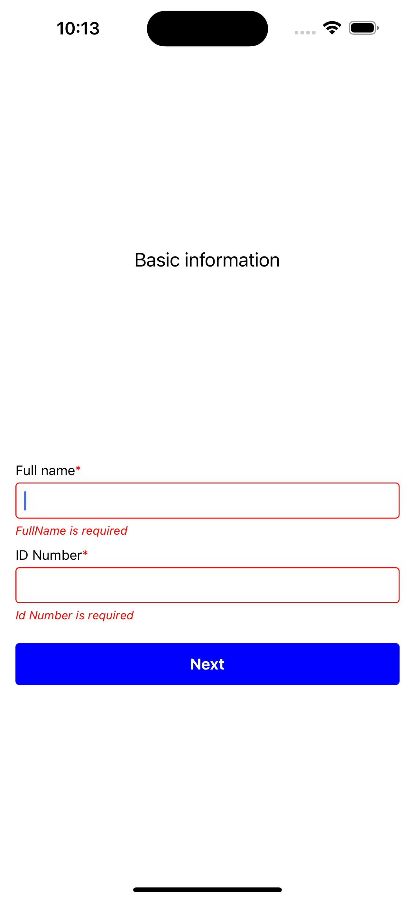
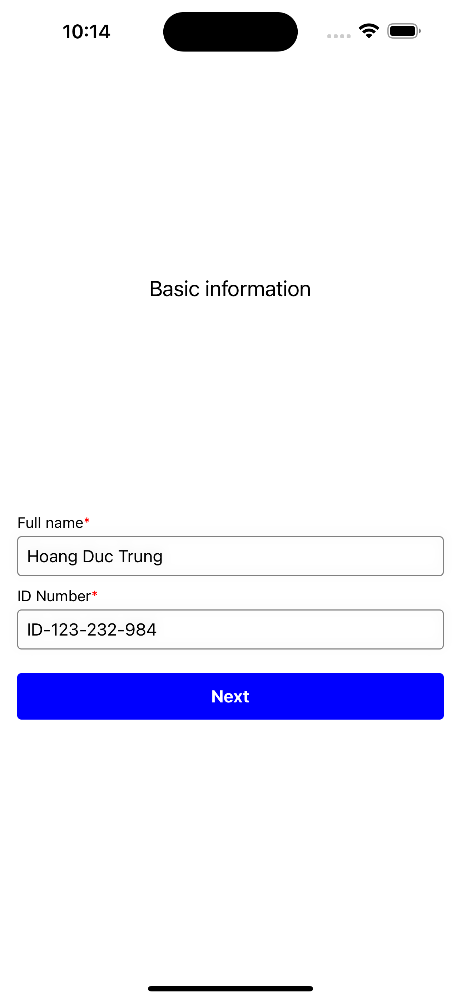
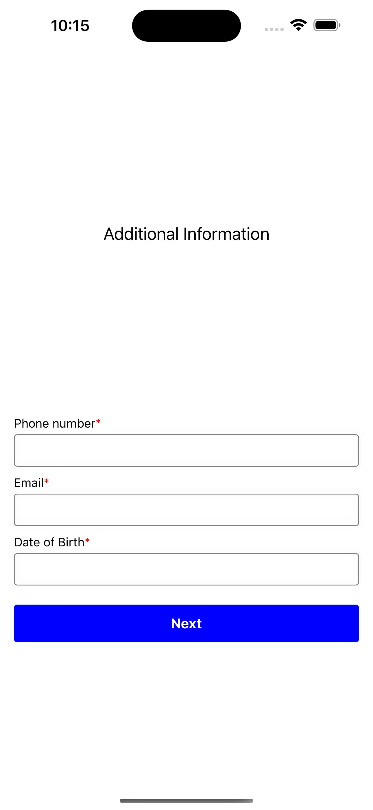
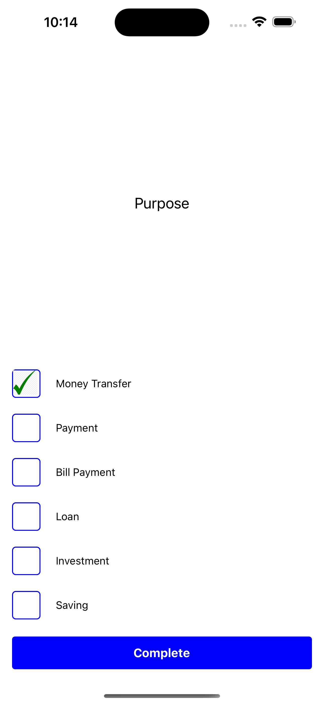
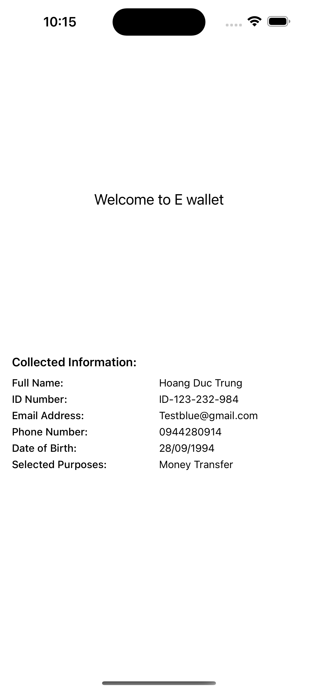

## BlueBik Wallet

## Description

Develop a simple onboarding flow for new users of the e-wallet product by leveraging ReactJS/ReactNative:

1.  Step A: Basic Information:
  Collect full name and ID number from the user
2.  Step B: Additional Information:
  Gather email address, phone number and date of birth
3.  Step C: Purpose - Choose one or multiple options:
  Allow user to select one or more purpose for using e-wallet product such as Money transfer, payment, bill payment, loan, investment or saving


## Folder structure

```js
+-- images // Images of screens.
+-- src // Sources files
|   +-- components // Common files.
|   |   +-- Buttons // Common buttons.
|   |   +-- Checkbox // Common checkbox.
|   |   +-- Header // Common layout header.
|   |   +-- TextInput // Common textInput.
|   |   +-- index // export all common.
|   +-- constants // Constants folder.
|   |   +-- app // Application config.
|   |   +-- layout // fonts, spaces, config.
|   +-- helpers // Constants folder.
|   |   +-- validate // email, phone validate.
|   +-- screens // Bussiness Modules.
|   |   +-- Onboarding // Example user module.
|   |   |   +-- index //
|   |   |   +-- stepOne.ts // Basic information.
|   |   |   +-- stepTwo.ts // Additional information.
|   |   |   +-- stepThree.ts // Purpose.
|   |   +-- ... // Other business modules.
+-- __test__ // Unit test with Jest.
+-- app.ts // App module file.
```

## Images

### Basic information screen




### Additional information screen



### Purpose screen



### Collected information screen

